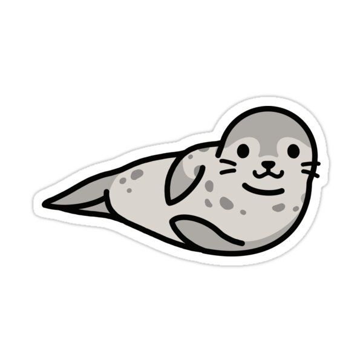
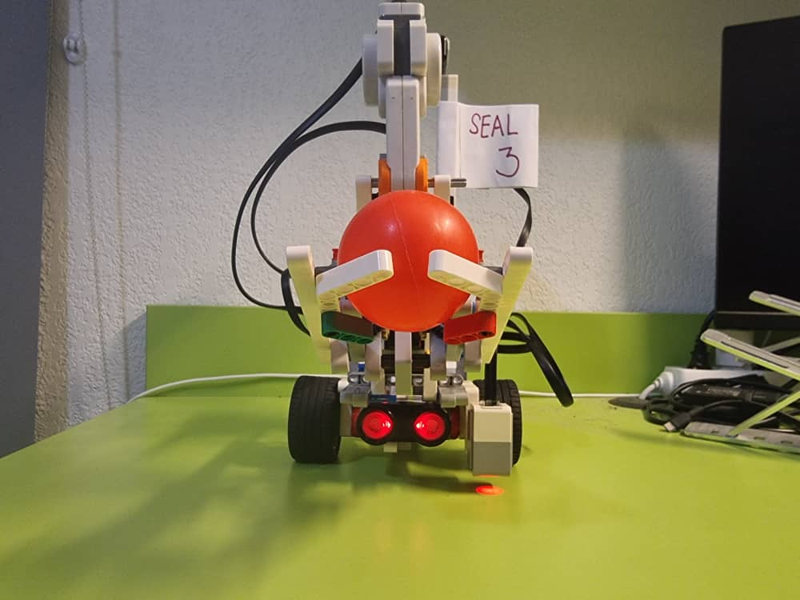
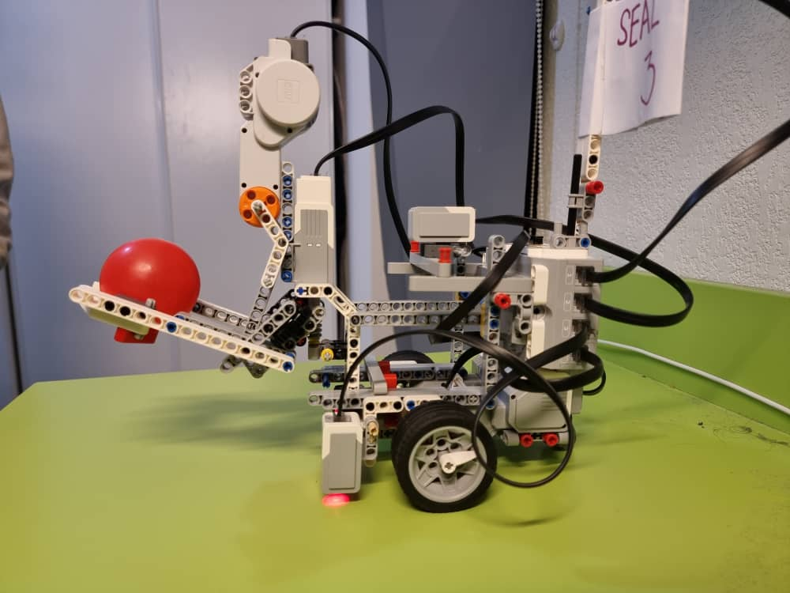
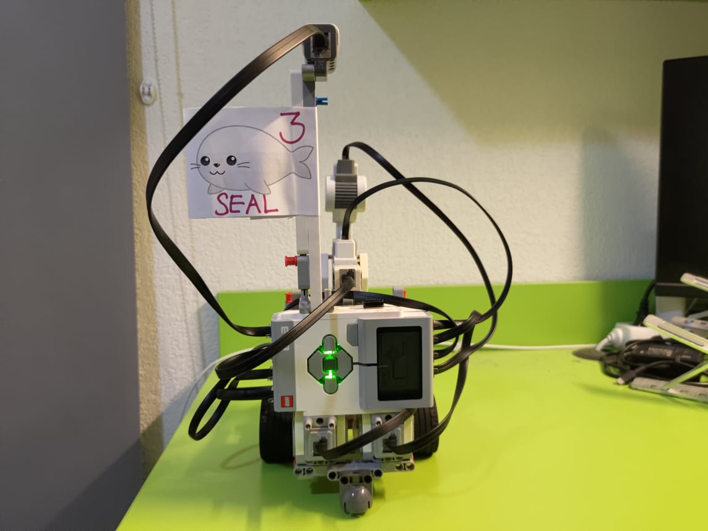
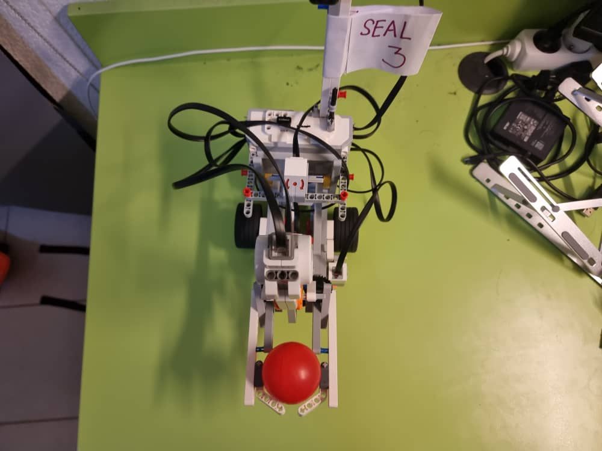

[TOC]
---

# Project of Fall 2022: "Attack/Defense basket-ball game" - Group number 3 (SEAL)

This project is created for OS course in EURECOM. The project is to design and code an EV3 Mindstorm Lego robot to play basketball as an attacker and also a defender.

## About us

  

Our members:
 - Khairul Annuar, SUHAIMI (Khairul.Suhaimi@eurecom.fr)
 - Muhamad Ikhwan, JOHARI (Muhamad.Johari@eurecom.fr)
 - Nguyen Duc, Khai ( Khai.Nguyen@eurecom.fr )
 - Huy Hung, LE (Huy-hung.le@eurecom.fr)

The name of our team is South East Asia lancer (SEAL).

Our website is [https://ikhwanjohari2.wixsite.com/mysite](https://ikhwanjohari2.wixsite.com/mysite).

For more information about the robot competition, visit [https://perso.telecom-paristech.fr/apvrille/OS/projects_fall2022.html](https://perso.telecom-paristech.fr/apvrille/OS/projects_fall2022.html)

## Our Robot design
The robot has been redesigned for many times.
At the beggining, we follow the defalt construction from LEGO. The first design version of the robot which used for the test section has a big arm which can grab the ball and thow it behind the robot. It use two motors for grabbing ball.

We try to redesigned such as only use one motor for both grabbing and lifting. The mechanism of grabbing and lifting was follow some video on youtube. But we failed when try to design the robot for throwing. So we come back to old form with some small improvemnt.

However, with the old form, we had a problem when we want to hold the arm in the middle air (to avoid block the sonar sensor).  The arm was too heavy. And we decided to redesign it again. This time, we success in combining throwing to the design.

Again, there is problem when we throw the ball. The force is not strong enough. It can throw ball but not very stayalbe. Also the angle when moving the arm is not stable and change randomly.

Finally, we create an improvement of the current design that can keep the ball consitently and not need to use the hand to hold it when moving. Also the throwing mechanism seems more reliable although we still need the ball bounce one to enter the basket. The robot can also hold two balls at the begining.

The robot complies to the specifications given which are:

- The robot must be contained in width=30cm, length=30cm, height=35cm maximum at start-up
- The robot must contain a flag, on which the number of your group is clearly readable from at least two sides of your robot. The flag dimension is at most 10x10cm. It may also contain a logo, a drawing, and the name of the robot
- The program you run should have been totally written in C.

## Robot Components

We utilise 4 motors and 3 sensors as follows :

1. 1st Motor : Right Wheel
2. 2nd Motor : Left Wheel
3. 3rd Motor : Kicker
   - Used to kick the ball and try to score into the basket
4. 4th Motor : Grappler
   - Used as a claw which will move downwards to grab the ball and upwards to hold the ball before it is kicked by the Kicker

5. 1st Sensor : Sonar Sensor
   - We use the sonar sensor to detect the distance between the robot and the ball, hence making the robot stops in a precise distance from the ball letting the grappler hand to be able to pickup the ball and keep it 
6. 2nd Sensor : Color Sensor
   - We use the color sensor to detect the colored line in front of the defensive area. This is used both in attacking and defending. For attacking, the color sensor prevents the robot from entering the defensive area which will make it loses points while in defending the color sensor prevents the robot from leaving the defensive area. This is to let the robot navigate and circulate in the area as an act of defending the goal
7. 3rd Sensor : Gyro Sensor
   - We use the gyro sensor to help the robot moves, navigates and making turns with precise calculations and data

## Our Strategy

### Attacking
- For attacking, our strategy is to score the ball that we already have in the grappler by going straight to the colored line using the color sensor.
- After reaching the colored line, the robot will kick the ball into the basket and making a right turn facing the ball on its right
- Robot will move slowly towards the ball until the sonar sensor detects the suitable distance, making the robot stops
- Robot will then pickup the ball in front of it and turns left facing the goal once again. It will kick the ball into the basketball
- Robot turns left facing the leftside of the arena, and move slowly towards the ball on its left until the sonar sensor detects the precised distance
- Robot will pickup the ball and make a right turn facing the goal and kick the ball into it

### Defending
- For defending, we use sonar sensor and color sensor for the navigation. If the robot detects the colored line or a wall in front of it, it will turn and avoid them
- Hence, making the robot navigates and roams in the defensive area

## Other files
In folder [robot_code/source/good_files](robot_code/source/good_files) has many file which test separated action of the robot by taking the input from use (the corresponding binary files is in [robot_code/source/good_files]). This help us do not need to recompile the program everytime the statics of the robot change or we when we redesign the robot.