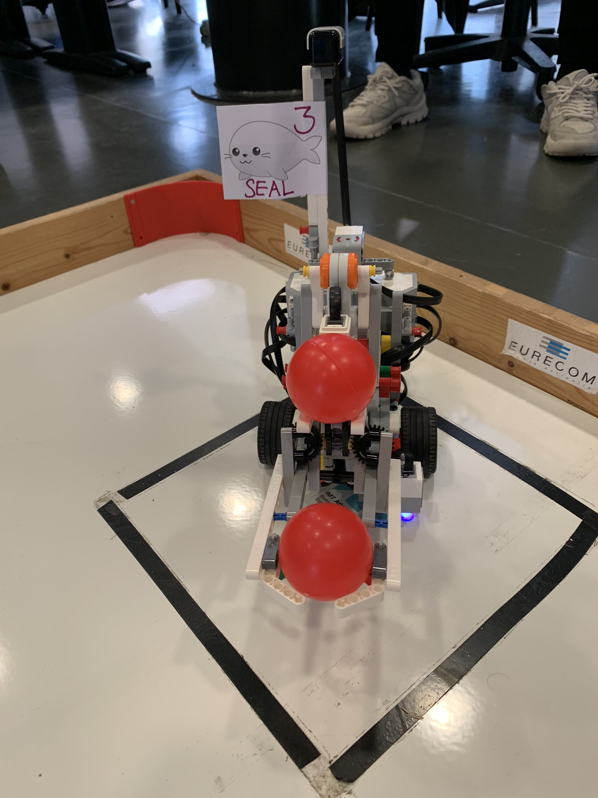
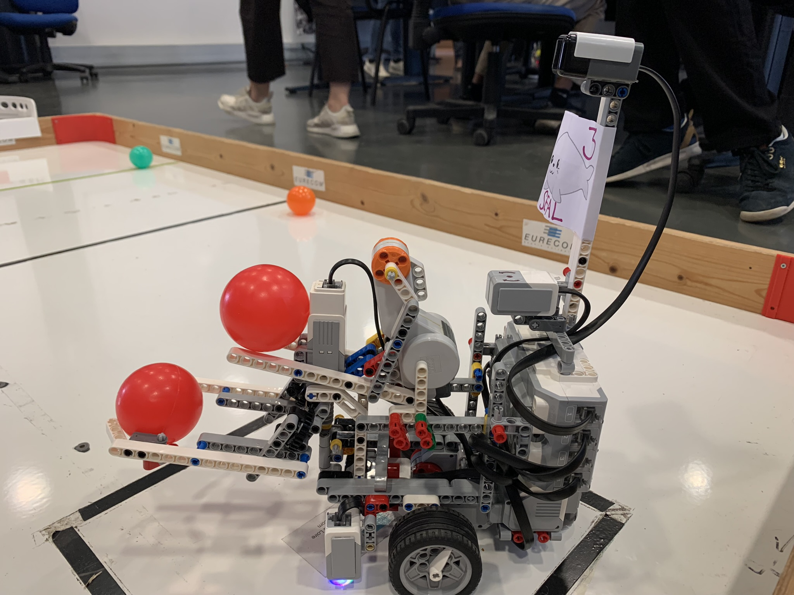
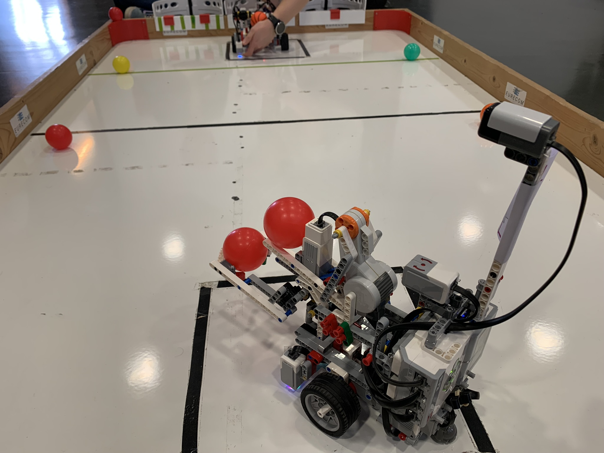
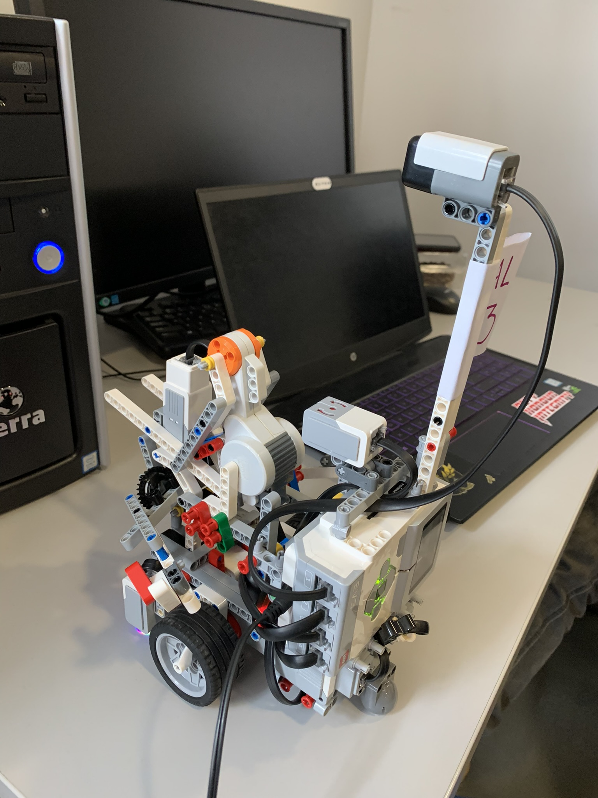
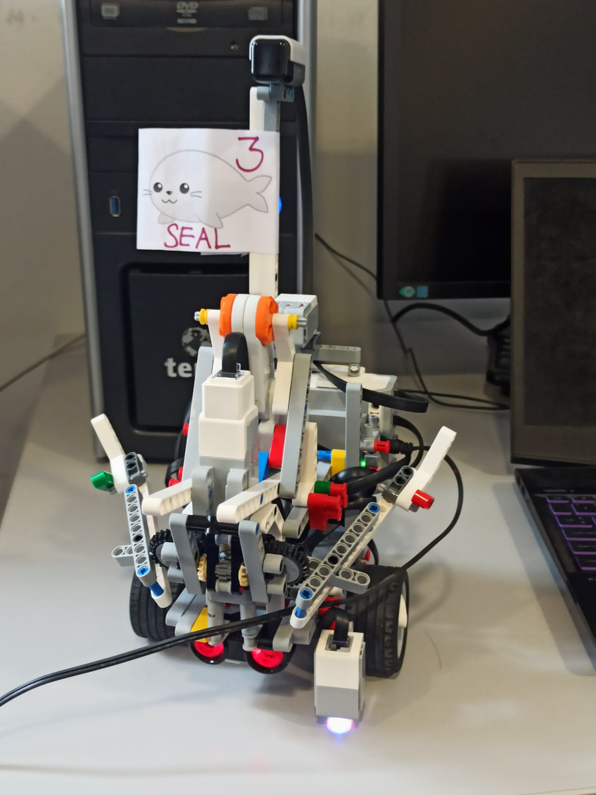

[[_TOC_]]
---

# Project of Fall 2022: "Attack/Defense basket-ball game" - Group number 3 (SEAL)

This project is created for OS course in EURECOM. The project is to design and code an EV3 Mindstorm Lego robot to play basketball as an attacker and also a defender.

For more information about the robot competition, visit [https://perso.telecom-paristech.fr/apvrille/OS/projects_fall2022.html](https://perso.telecom-paristech.fr/apvrille/OS/projects_fall2022.html)

## About us
<p align="center">
  
</p>

Our members:
 - Khairul Annuar, SUHAIMI (Khairul.Suhaimi@eurecom.fr)
 - Muhamad Ikhwan, JOHARI (Muhamad.Johari@eurecom.fr)
 - Nguyen Duc, Khai ( Khai.Nguyen@eurecom.fr )
 - Huy Hung, LE (Huy-hung.le@eurecom.fr)

The name of our team is South East Asia lancer (SEAL).

Our website is [https://ikhwanjohari2.wixsite.com/mysite](https://ikhwanjohari2.wixsite.com/mysite).


## Our Robot design
The robot complies to the specifications given which are:

- The robot must be contained in width=30cm, length=30cm, height=35cm maximum at start-up
- The robot must contain a flag, on which the number of your group is clearly readable from at least two sides of your robot. The flag dimension is at most 10x10cm. It may also contain a logo, a drawing, and the name of the robot
- The program you run should have been totally written in C.


Our robot has been redesigned for many times which is time consuming and affected a lot the current writting code. However, we went through the problem with patient and with some test functions which takes input from users (see [robot_code/source/good_files](robot_code/source/good_files) and [robot_code/bin/good_files](robot_code/bin/good_files)).
At the beggining, we follow the default construction from LEGO. to get a first imagination of the design.

### First design (Ikhwan and Khairul)
See the video for the very first version:
[videos/first_design.mp4](videos/first_design.mp4)

The first design version of the robot which used for the test section had a big arm (similar to above video) which can grab the ball and threw it behind the robot. It used two motors for grabbing ball. This version of robot does the throwing and grabbing very stable and consistent.

We wanted to  redesign such that we  only use one motor for both grabbing and lifting. If we can do it, it will be easy when writting code for grabbing or throwing.
- The mechanism of grabbing and lifting followed [a video on youtube](https://www.youtube.com/watch?v=nTLB9GWRyuo).
- But we failed when try to design the throwing mechanism. So we reconstructed to old form (first design) with some small improvemnt.


### Second design (Hung, Ikhwan, Khairul)
However, with the old form, we had a problem when we want to hold the arm in the middle air (to avoid block the sonar sensor).  The arm was too heavy. And we decided to redesign it again. This time, we success in combining throwing to the design.

The grabbing and lifting using only one motor followed the principal mechanism in this video [https://www.youtube.com/watch?v=nTLB9GWRyuo](https://www.youtube.com/watch?v=nTLB9GWRyuo). We remove all the unnecessary part, keep only the main components and build the hand base on that.

 - The small motor is used for grabbing and lift together. So we only need to test the speed and time running for the motor to have a good place.

 - The big orange motor is use for throwing ball and attached in front and inverse with the grabbing motor as in the side view. However, through testing, the ball threw not very far. It can sometimes score balls but not reliable.
 - Ikhwan and Khairul improved the design with additional component under the grabbing motor, which is a base preventing some parts falling down (since the grabber motor heads to the ground).


### Final designed (Hung)
With the second design, there was problem when we threw the ball. The force was not strong enough. It could throw ball but it was not very stayble. Also the angle when moving the arm is not stable and change randomly. And we decided to redesigned it.

The final design kept the structure of grabbing and lifting using only one motor of the second design. We attached the throwing motor behind the grabbing motor and assemble the kicker such as it can turn full cirle without being blocked. Then we added a block at a fixed possition as a reset point for the kicker.

With this design:
 - The robot can keep the ball consitently and not need to use the hand to hold it when moving.
 - The robot can also hold two balls at the begining.
 - Finally, the throwing mechanism seems more reliable although we still need the ball bounce one time before entering the basket. We set up the speed and time such as it can score at defender line.








## Robot Components

We utilise 4 motors and 3 sensors as follows :

1. 1st Motor : Right Wheel
2. 2nd Motor : Left Wheel
3. 3rd Motor : Kicker
   - Used to kick the ball and try to score into the basket
4. 4th Motor : Grappler
   - Used as a claw which will move downwards to grab the ball and upwards to hold the ball before it is kicked by the Kicker.
  This motor is used for both grabbing and lifting the ball.

5. 1st Sensor : Sonar Sensor
   - We use the sonar sensor to detect the distance between the robot and the ball, hence making the robot stops in a precise distance from the ball letting the grappler hand to be able to pickup the ball and keep it 
6. 2nd Sensor : Color Sensor
   - We use the color sensor to detect the colored line in front of the defensive area. This is used both in attacking and defending. For attacking, the color sensor prevents the robot from entering the defensive area which will make it loses points while in defending the color sensor prevents the robot from leaving the defensive area. This is to let the robot navigate and circulate in the area as an act of defending the goal

(We assembled the Compass sensor but haven't used it yet.)

## Our Strategy

### Attacking
- For attacking, our strategy is to score the ball that we already have in the grappler by going straight to the colored line using the color sensor.
- After reaching the colored line, the robot will kick the ball into the basket and making a right turn facing the ball on its right
- Robot will move slowly towards the ball until the sonar sensor detects the suitable distance, making the robot stops
- Robot will then pickup the ball in front of it and turns left facing the goal once again. It will kick the ball into the basketball
- Robot turns left facing the leftside of the arena, and move slowly towards the ball on its left until the sonar sensor detects the precised distance
- Robot will pickup the ball and make a right turn facing the goal and kick the ball into it

### Defending
- For defending, we use sonar sensor and color sensor for the navigation. If the robot detects the colored line or a wall in front of it, it will turn and avoid them
- Hence, making the robot navigates and roams in the defensive area

## Other files and cross-compiling
- File [robot_code/Makefile](robot_code/Makefile) is used for cross-compiling on docker, which can compile any c files in folder [robot_code/source](robot_code/source) and create a binary file with corresponding name in folder [robot_code/bin](robot_code/bin).
- The command to run docker is
```bash
docker run --rm -it -h ev3 -v $(pwd):/src -w /src ev3cc /bin/bash
```
Here, assume that you want to open docker in current directory  (normally, it is the folder [robot_code](robot_code)) and the file name path don't have space.

- To run cross-compiling, the structure of the folder should be the same as describing in the [Makefile](robot_code/Makefile). And, you also need to have the library [robot_code/libraries/libev3dev-c.a](robot_code/libraries/libev3dev-c.a). For more detail about cross-compiling, see [https://perso.telecom-paristech.fr/apvrille/OS/projects_fall2022.html](https://perso.telecom-paristech.fr/apvrille/OS/projects_fall2022.html) or [the home page](https://www.ev3dev.org/docs/tutorials/using-docker-to-cross-compile/) .

- Folder [robot_code/source/good_files](robot_code/source/good_files) has many files which for testing separated action of the robot by taking the input from use (the corresponding binary files is in [robot_code/source/good_files]). This help us do not need to recompile the program everytime the statics of the robot change or we when we redesign the robot.

- File [robot_code/throwBall.md](robot_code/throwBall.md) has an initial idea of the design which is very similar to the final design. 


## Some notes after the competition
### Result
- We win as the team score the most balls (9/10 games). The second team scored 8 balls. Our strategy is throwing ball when the robot detect the defender line which is more accuracy than team 2 (it seems that their position when score ball depend on the initial possition, which is not reliable).
- Some teams has a strategy: do nothing as defender :) and wait the attacker pass the defender line to get points. It helped them get some points when the attacker don't have a good score mechanism.
- Team 2 seems to have a good algorithm to grab balls on the ground.
- There is one team can score ball from attacker area (which is very far) but not very effective.
- It seems that most of the robot starting by going straight in the middle.
### Some bugs in the competition
 
 - We score one ball almost every game except the last one. There is an error with the color sensor in the last game. It detect yellow (defender line) right after starting and shoting balls early. We guess that the reason maybe the light from the light buld of the room is yellow.
 - Sometimes, there is a problem that the right motor does not run. We need to reset the robot and it will be normal.
 - The kicker motor also had a problem. It rotated in the same direction even if you set the speed is negative or possitive. The reason maybe the setting speed is too high.
 - The arm of our robot are pretty weak. In the first game, it was broken because of colliding with defender robot (but we still score point).
 - There was a robot not packing good the wire systems. The head of the wire stuck on the arena border and made the defender robot change direction and go straight to the attacker area :).


## Some remarks for the future
 - Write a program to avoid the other robot. Algorithm: If there is an object ahead: fallback, turn righ (left), turn left (right) respectively (use this when we want to travel to a possition which does not have any objects in the way).
 - Set timeout for some code: to avoid stuck in some special cases (the program is in infinite loops).
 - Write program using multithreads, mutex and condition variable.
 - Write a program move the robot at any position to a reset point (a point that we know coordinate). Ideas:
   - use compass for detecting the direction
   - use gyro to head to the right direction (we have a program to turn the robot with exactly angle using the gyro sensor in [robot_code/source/good_files/turn_angle_motor_with_gyro.c](robot_code/source/good_files/turn_angle_motor_with_gyro.c)). 
    - Move the robot straight forward or backward until detecting the line (defender or attacker. Prefer attacker line since there would have no other robot there).
    - At this position, turn left 90 degree and using sonar to measure distance to the arena side border, then turn right 180 degree and using sonar to measure distance to the other arena side border. (since we are facing perpencular with the arena side, the value of sonar sensor should be stable).
    - Take the sum of two distances above, compare it with the width of the arena. If the result is approximate then we know where is the robot now. If the result is noticely different then there is some objects between the robot and the sides. Move the robot straight forward or backward and repeat the measure to the side. Then we will know which side has the objects.