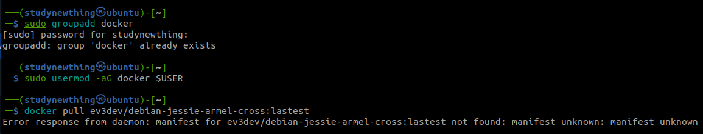
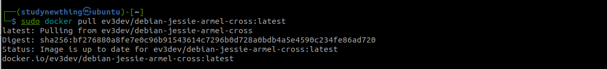

# I. Robot setup and installation
All installation guide and examples are provide in the course link
[https://perso.telecom-paristech.fr/apvrille/OS/projects_fall2022.html](https://perso.telecom-paristech.fr/apvrille/OS/projects_fall2022.html)

This part is a recap.

1. Cross compilation
- Install docker
- 
```bash
sudo apt-get install docker-ce
sudo groupadd docker
sudo gpasswd -a ${USER} docker
sudo service docker start
sudo docker pull ev3dev/debian-jessie-armel-cross:latest
```
Some remarks:
 - We need to install docker-ce instead of docker-engine.
 - It seem that we can not run docker even if we create a group for docker and add us to the group.
 
 The last command need to run with sudo
 

 # More detail about cross compilation
Clone the project of ev3
```
 git clone https://github.com/in4lio/ev3dev-c
```
then
 ```
docker run --rm -it -h ev3 -v ~/sharedDriver/Git_projects/os_labs/robot_project/:/src -w /src ev3cc /bin/bash
 ```
 where ~/sharedDriver/Git_projects/os_labs/robot_project/ is the path you want docker open in.

Inside docker, go to /src/ev3dev-c/source/ev3 folder (which is inside the gitproject that you clone) and run
 ```
 [Shell in container]$ make&&sudo make install&&make shared&&sudo make shared-install
 ```
 Now, inside your Makefile, add "export LD_LIBRARY_PATH=~/ev3_lib/ev3dev-c/lib"
 and change gcc to "arm-linux-gnueabi-gcc"