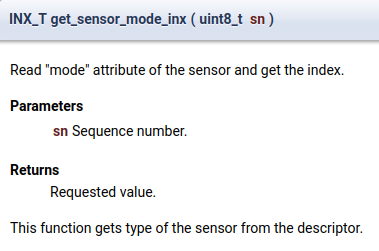

# Basic functions

```C
ev3_sensor_type( ev3_sensor[ i ].type_inx )
```
input: a variable about the type of sensor connect to port $i$ th.
output a string (%s): sensor type
```
ev3_sensor_port_name( i, s )
```
input: integer $i$ (0,3)
        s: pointer to a string that will store the name of the sensor connected to port $i$
It returns 0 if the port is not connected or the sensor is not supported, 1 otherwise

```
get_sensor_mode( i, s, sizeof( s ))
```
i : sensor port number
s : pointer to store the mode
sizeof(s): prevent buff overflows.


if ( ev3_search_sensor( LEGO_EV3_TOUCH, &sn_touch, 0 ))

if ( ev3_search_sensor( LEGO_EV3_COLOR, &sn_color, 0 ))

if (ev3_search_sensor(HT_NXT_COMPASS, &sn_compass,0))

if (ev3_search_sensor(LEGO_EV3_US, &sn_sonar,0))

if (ev3_search_sensor(NXT_ANALOG, &sn_mag,0))

Sleep( 200 );


## Useful modes of Ultrasonic sensor

US-DIST-CM: continuous measurement  -  set LEDs on, steady
US-SI-CM: single measurement - set LEDs on then off.
Both has values 0-2550
For the single measurement mode, should put a delay of at least 250ms between each usage.


## possible value of ev3_sensor[1].type_inx is : (without quotient)
TOUCH_SENSOR
COLOR_SENSOR
ULTRASONIC_SENSOR


```C
ev3_sensor_init();

	for ( i = 0; i < DESC_LIMIT; i++ ) {
		if ( ev3_sensor[ i ].type_inx != SENSOR_TYPE__NONE_ ) {
			ev3_sensor_port_name( i, s );
            printf(" Name = %s\n",s);
			printf("  Port = %s\n", ev3_sensor_port_name( i, s ));
            
            printf("  ev3_sensor_type( ev3_sensor[ %d ].type_inx =   %s\n", i, ev3_sensor_type( ev3_sensor[ i ].type_inx ));
			if ( get_sensor_mode( i, s, sizeof( s ))) {
				printf( "  Mode = %s\n", s );
			}
		}
	}
	

	ev3_uninit();
	printf( "*** ( EV3 ) Bye! ***\n" );

	return ( 0 );
```

The result


# Functions





# Sensor type

SENSOR_TYPE__NONE_ = 0,  /* XXX: memset( 0 ) is used */
   81 
   82     EV3_ANALOG_XX,
   83     NXT_ANALOG,
   84     PIXY_LEGO,
   85     DI_DFLEX,
   86     FCL_9DOF,
   87     FCL_ADC,
   88     FCL_ALTITUDE,
   89     FCL_GESTURE,
   90     FCL_HUMIDITY,
   91     FCL_IR,
   92     FCL_LIGHT,
   93     HT_NXT_COLOR,
   94     HT_NXT_ANGLE,
   95     HT_NXT_ACCEL,
   96     HT_NXT_BAROMETRIC,
   97     HT_NXT_COLOR_V2,
   98     HT_NXT_EOPD,
   99     HT_NXT_FORCE,
  100     HT_NXT_GYRO,
  101     HT_NXT_IR_LINK,
  102     HT_NXT_IR_RECEIVER,
  103     HT_NXT_PIR,
  104     HT_NXT_COMPASS,
  105     HT_NXT_MAG,
  106     HT_NXT_IR_SEEK_V2,
  107     HT_NXT_SMUX,
  108     HT_SUPER_PRO,
  109     LEGO_EV3_US,
  110     LEGO_EV3_GYRO,
  111     LEGO_EV3_COLOR,
  112     LEGO_EV3_TOUCH,
  113     LEGO_EV3_IR,
  114     WEDO_HUB,
  115     WEDO_MOTION,
  116     WEDO_TILT,
  117     LEGO_POWER_STORAGE,
  118     LEGO_NXT_TEMP,
  119     LEGO_NXT_TOUCH,
  120     LEGO_NXT_LIGHT,
  121     LEGO_NXT_SOUND,
  122     LEGO_NXT_US,
  123     MI_XG1300L,
  124     MS_ABSOLUTE_IMU,
  125     MS_ANGLE,
  126     MS_EV3_SMUX,
  127     MS_LIGHT_ARRAY,
  128     MS_LINE_LEADER,
  129     MS_NXTCAM,
  130     MS_NXTCAM5,
  131     MS_NXTMMX,
  132     MS_8CH_SERVO,
  133     MS_PPS58_NX,
  134     MS_PIXY_ADAPTER,
  135     MS_NXT_TOUCH_MUX,


  # Mode

  SENSOR_MODE__NONE_ = 0,
  146 
  147     EV3_ANALOG_XX_ANALOG,           
  148     NXT_ANALOG_ANALOG_0, 
  149     NXT_ANALOG_ANALOG_1,            
          
  175     FCL_LIGHT_ILLUMINANCE,          
  176     HT_NXT_COLOR_COLOR, 
  177     HT_NXT_COLOR_RED, 
  178     HT_NXT_COLOR_GREEN, 
  179     HT_NXT_COLOR_BLUE, 
  180     HT_NXT_COLOR_RAW, 
  181     HT_NXT_COLOR_NORM, 
  182     HT_NXT_COLOR_ALL,           
  183     HT_NXT_ANGLE_ANGLE, 
  184     HT_NXT_ANGLE_ANGLE_ACC, 
  185     HT_NXT_ANGLE_SPEED,             
  186     HT_NXT_ACCEL_ACCEL, 
  187     HT_NXT_ACCEL_ALL,           
  188     HT_NXT_BAROMETRIC_PRESS, 
  189     HT_NXT_BAROMETRIC_TEMP,             
  190     HT_NXT_COLOR_V2_COLOR, 
  191     HT_NXT_COLOR_V2_RED, 
  192     HT_NXT_COLOR_V2_GREEN, 
  193     HT_NXT_COLOR_V2_BLUE, 
  194     HT_NXT_COLOR_V2_WHITE, 
  195     HT_NXT_COLOR_V2_NORM, 
  196     HT_NXT_COLOR_V2_ALL, 
  197     HT_NXT_COLOR_V2_PASSIVE, 
  198     HT_NXT_COLOR_V2_RAW,            
  199     HT_NXT_EOPD_LONG, 
  200     HT_NXT_EOPD_SHORT,          
  201     HT_NXT_FORCE_FORCE,             
  202     HT_NXT_GYRO_GYRO,           
  203     HT_NXT_IR_LINK_IRLINK,          
  204     HT_NXT_IR_RECEIVER_1_MOTOR, 
  205     HT_NXT_IR_RECEIVER_8_MOTOR,             
  206     HT_NXT_PIR_PROX,            
  207     HT_NXT_COMPASS_COMPASS,             
  208     HT_NXT_MAG_MAG,             
  209     HT_NXT_IR_SEEK_V2_DC, 
  210     HT_NXT_IR_SEEK_V2_AC, 
  211     HT_NXT_IR_SEEK_V2_DC_ALL, 
  212     HT_NXT_IR_SEEK_V2_AC_ALL,           
  213     HT_NXT_SMUX_MUX,            
        
  222     LEGO_EV3_US_US_DIST_CM, US_US_DIST_CM = LEGO_EV3_US_US_DIST_CM,
  223     LEGO_EV3_US_US_DIST_IN, US_US_DIST_IN = LEGO_EV3_US_US_DIST_IN,
  224     LEGO_EV3_US_US_LISTEN, US_US_LISTEN = LEGO_EV3_US_US_LISTEN,
  225     LEGO_EV3_US_US_SI_CM, US_US_SI_CM = LEGO_EV3_US_US_SI_CM,
  226     LEGO_EV3_US_US_SI_IN, US_US_SI_IN = LEGO_EV3_US_US_SI_IN,
  227     LEGO_EV3_US_US_DC_CM, US_US_DC_CM = LEGO_EV3_US_US_DC_CM,
  228     LEGO_EV3_US_US_DC_IN, US_US_DC_IN = LEGO_EV3_US_US_DC_IN,           
  229     LEGO_EV3_GYRO_GYRO_ANG, GYRO_GYRO_ANG = LEGO_EV3_GYRO_GYRO_ANG,
  230     LEGO_EV3_GYRO_GYRO_RATE, GYRO_GYRO_RATE = LEGO_EV3_GYRO_GYRO_RATE,
  231     LEGO_EV3_GYRO_GYRO_FAS, GYRO_GYRO_FAS = LEGO_EV3_GYRO_GYRO_FAS,
  232     LEGO_EV3_GYRO_GYRO_G_AND_A, GYRO_GYRO_G_AND_A = LEGO_EV3_GYRO_GYRO_G_AND_A,
  233     LEGO_EV3_GYRO_GYRO_CAL, GYRO_GYRO_CAL = LEGO_EV3_GYRO_GYRO_CAL,         
  234     LEGO_EV3_COLOR_COL_REFLECT, COLOR_COL_REFLECT = LEGO_EV3_COLOR_COL_REFLECT,
  235     LEGO_EV3_COLOR_COL_AMBIENT, COLOR_COL_AMBIENT = LEGO_EV3_COLOR_COL_AMBIENT,
  236     LEGO_EV3_COLOR_COL_COLOR, COLOR_COL_COLOR = LEGO_EV3_COLOR_COL_COLOR,
  237     LEGO_EV3_COLOR_REF_RAW, COLOR_REF_RAW = LEGO_EV3_COLOR_REF_RAW,
  238     LEGO_EV3_COLOR_RGB_RAW, COLOR_RGB_RAW = LEGO_EV3_COLOR_RGB_RAW,
  239     LEGO_EV3_COLOR_COL_CAL, COLOR_COL_CAL = LEGO_EV3_COLOR_COL_CAL,         
  240     LEGO_EV3_TOUCH_TOUCH, TOUCH_TOUCH = LEGO_EV3_TOUCH_TOUCH,           
  241     LEGO_EV3_IR_IR_PROX, IR_IR_PROX = LEGO_EV3_IR_IR_PROX,
  242     LEGO_EV3_IR_IR_SEEK, IR_IR_SEEK = LEGO_EV3_IR_IR_SEEK,
  243     LEGO_EV3_IR_IR_REMOTE, IR_IR_REMOTE = LEGO_EV3_IR_IR_REMOTE,
  244     LEGO_EV3_IR_IR_REM_A, IR_IR_REM_A = LEGO_EV3_IR_IR_REM_A,
  245     LEGO_EV3_IR_IR_S_ALT, IR_IR_S_ALT = LEGO_EV3_IR_IR_S_ALT,
  246     LEGO_EV3_IR_IR_CAL, IR_IR_CAL = LEGO_EV3_IR_IR_CAL,         

  263     LEGO_NXT_TOUCH_TOUCH,           
  264     LEGO_NXT_LIGHT_REFLECT, 
  265     LEGO_NXT_LIGHT_AMBIENT,             
  266     LEGO_NXT_SOUND_DB, 
  267     LEGO_NXT_SOUND_DBA,             
  268     LEGO_NXT_US_US_DIST_CM, 
  269     LEGO_NXT_US_US_DIST_IN, 
  270     LEGO_NXT_US_US_SI_CM, 
  271     LEGO_NXT_US_US_SI_IN, 
  272     LEGO_NXT_US_US_LISTEN,          
 
