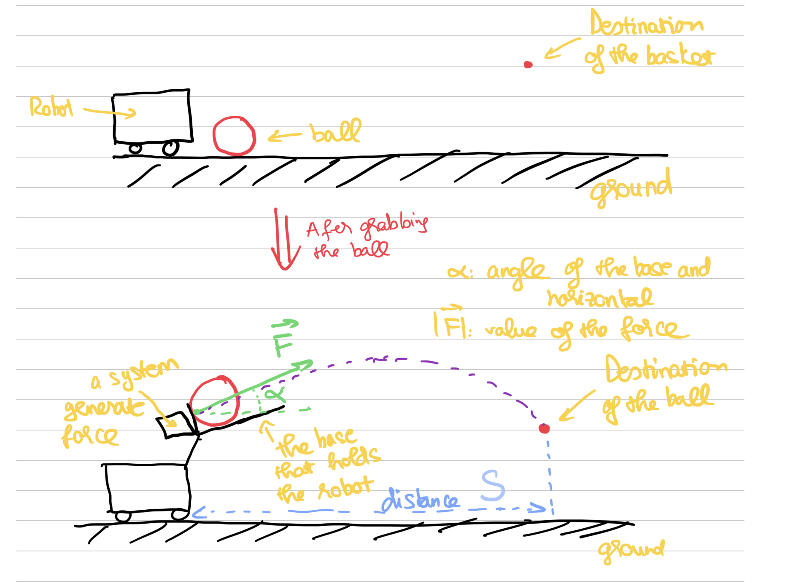
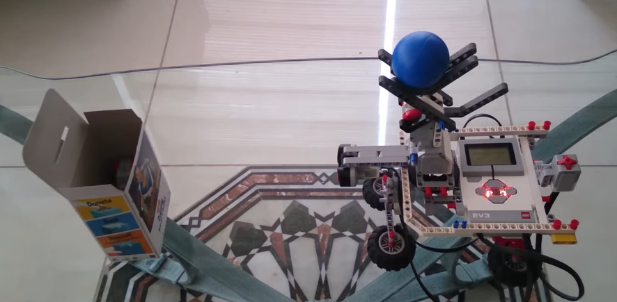
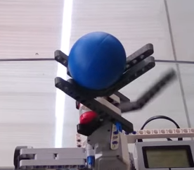
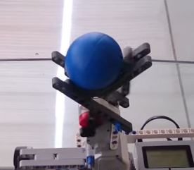
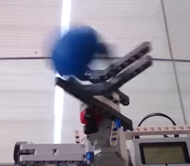
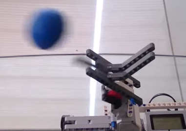
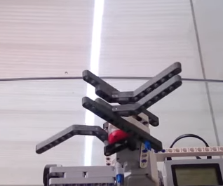
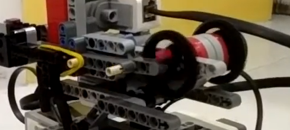
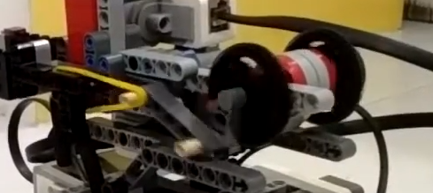
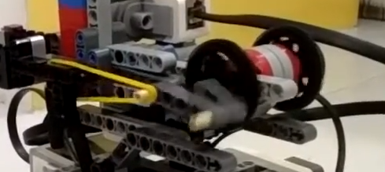

# Throw ball (after grabbing the ball)
 There are two important thing we need to do:
  1. Design the architecture of the arm to grab the ball using the light motor (weak motor but more precise)
   Design a system that can generate a force using the rest motor.
   2. The algorithm: after grabbing the ball, lift it to a certain high and at this high, the base that the ball put it should have a compatible angle. Then input some force parallel with the base  and at behin the ball to push the ball in the direction of the base and toward the basket.

Here is the sketch:

The algorithm would depend on the real test and other functions.

The algorithm:
 - call the function to detect the distance with the basket.
 - call the function to move the robot to a possition X. This position is in an arc having the basket as the center.
Suppose the distance between this fix possition and the basket is S (the radius of the arc).
 - call the function to turn the robot face to the basket.
 - generate a force from the 4th motor. The strong of the force is F.
  

The algorithm should generate the distance S, the strong of the force F to make the ball flight to the basket at a fixed possition with the height h.

Some remarks:
 -  I guess that we don't modify much about the force F. In the algorithm, it should be like a "constant" (it can have many values but limmited). The algorithm should generate S depending on F and h.
  The reason is that: it is easier to modify S with two wheel motors of the robot and a gyro sensor. If S is large, to calculate the value of F to be able to score the ball will depend on many real life data testing and the architecture of the robot arms.
  - The value of S has rome restrictions (the rule of the game: can not pass some lines in the arena). So the force F should not be a constant but can change to some pre-defined values if needed.
  - In the website of lego ev3, there are some example about assembling the arms:
  [https://education.lego.com/en-us/product-resources/mindstorms-ev3/downloads/building-instructions](https://education.lego.com/en-us/product-resources/mindstorms-ev3/downloads/building-instructions)
 - I think that the reality hard part is to designed the architecture of the arms and the system generating forces. I found some ideas about the mechanism of the system generate forces + the arms. I like the second ideas about generating force. It seems to be doable comparing to the first one.
      - [https://www.youtube.com/watch?v=TieulyRpZCo](https://www.youtube.com/watch?v=TieulyRpZCo)
Some pictures from the video:

 |   
 |   

The downside of this is that it is hard to keep the ball from the step grabbing ball.
      - [https://www.youtube.com/watch?v=fV67WXD0V6k](https://www.youtube.com/watch?v=fV67WXD0V6k)
  Watch the video at 2:16 to see the mechanism. The video also have a part about buiding the mechanism. Some pictures from video:
  
  the wheel moves make the red part in the wheel moves:
  
  